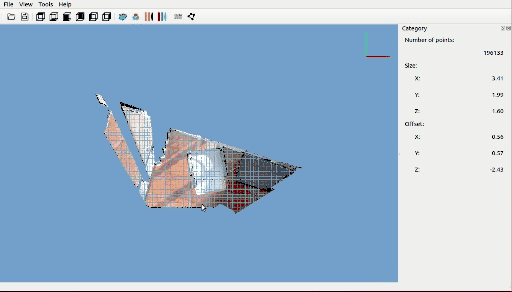
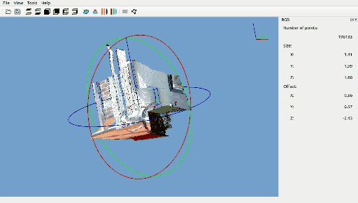

# [PSAT](http://www.yatenglg.cn/psat) - Point cloud segmentation annotation tools


[中文](README.md) [English](README-en.md)

## Install

```shell
git clone https://github.com/yatengLG/PSAT.git
cd PSAT
conda create -n PSAT python==3.8
conda activate PSAT
pip install -r requests.txt
```

## Annotate
1. Add category and set color for show in setting.
2. Open point cloud file
3. Start annotate by button named [Pcik],draw polygon to select area by left button of mouse.
3. End annotate by right button of mouse.
4. Select category and set group if for instance.


## Ground filter
Software integrated with [CSF](https://github.com/jianboqi/CSF)，and provide the function of quickly extracting the ground 。
The software turns off the ground filtering function by default. 
Manually install the [CSF](https://github.com/jianboqi/CSF#how-to-use-csf-in-python), and then automatically turn on the ground filtering function.


