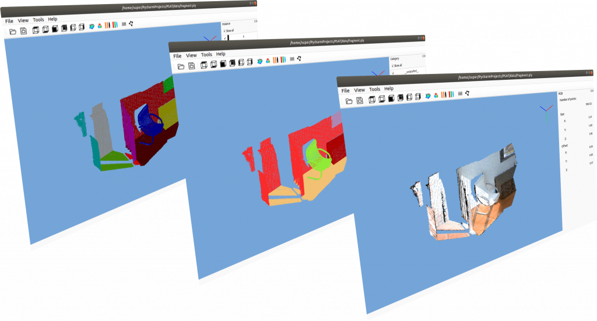
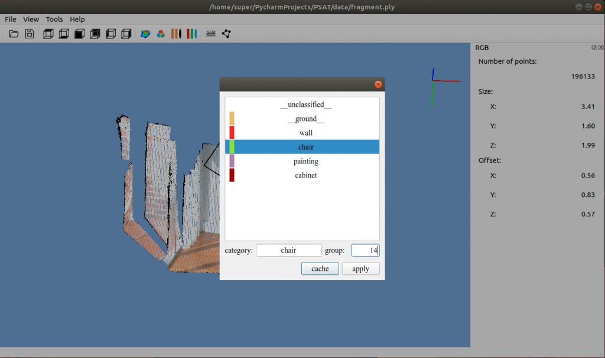
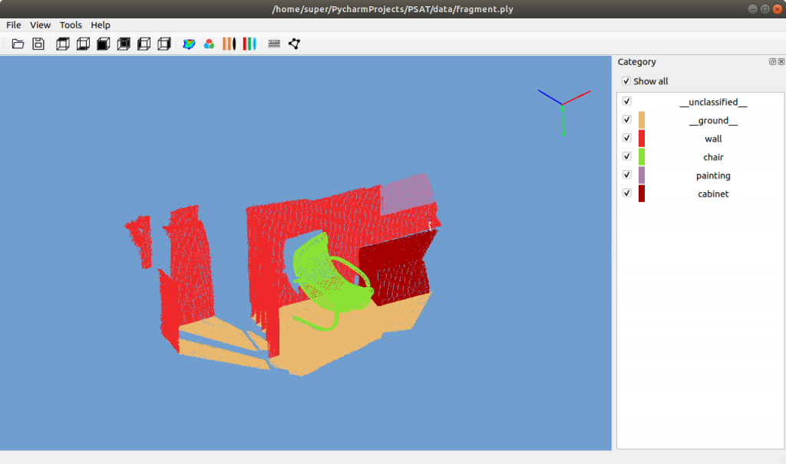
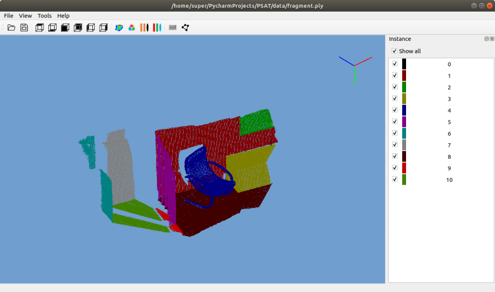

# [PSAT](http://www.yatenglg.cn/psat) - 点云分割标注工具


[中文](README.md) [English](README-en.md)
# 简介
深度学习点云分割标注工具

1. 实现十万级别点云流畅标注,百万级别点云流畅可视化
2. 支持同时标注语义分割与实例分割

## 标注
通过多边形框选点云，选择类别并指定实例组id

## 标注结果
语义分割标注（类别标注）

实例分割标注（单体标注）


## 地面提取
软件集成了[CSF布料滤波](https://github.com/jianboqi/CSF)算法，提供快速提取地面的功能。
软件默认关闭地面滤波功能，手动安装[CSF](https://github.com/jianboqi/CSF#how-to-use-csf-in-python)后，自动开启。

# 安装

```shell
git clone https://github.com/yatengLG/PSAT.git
cd PSAT
conda create -n PSAT python==3.8
conda activate PSAT
pip install -r requests.txt
```

